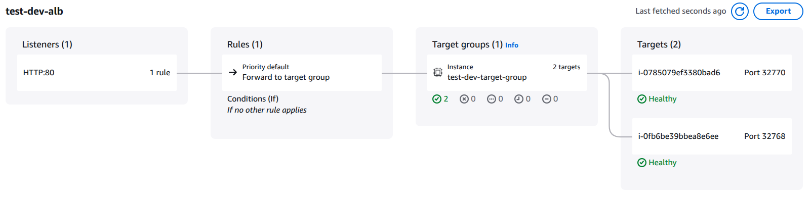
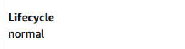

# prjctr-26-autoscaling-groups

### Setup

```shell
docker build -t test-dev:latest .
docker tag test-dev:latest 523717802721.dkr.ecr.eu-central-1.amazonaws.com/test-dev:latest
aws ecr get-login-password --region eu-central-1 | docker login --username AWS --password-stdin 523717802721.dkr.ecr.eu-central-1.amazonaws.com/test-dev
docker push 523717802721.dkr.ecr.eu-central-1.amazonaws.com/test-dev:latest
cd terraform
terraform init
terraform apply
```

### Check auto-scaling

```shell
siege -c 50 -t 5M http://test-dev-alb-1632961615.eu-central-1.elb.amazonaws.com/
sleep 10
siege -c 100 -t 5M http://test-dev-alb-1632961615.eu-central-1.elb.amazonaws.com/
sleep 10
siege -c 200 -t 5M http://test-dev-alb-1632961615.eu-central-1.elb.amazonaws.com/
```

### Results

Initial setup:



Initial instances:

 


Scaled setup:


Auto-scaling logs:


Scaling policies list:


